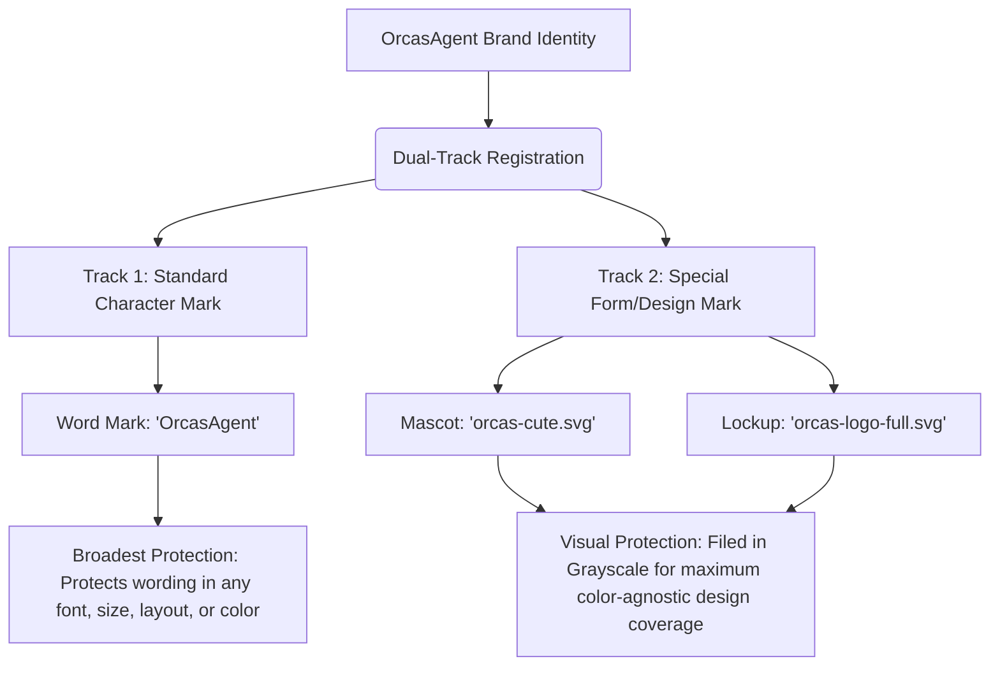
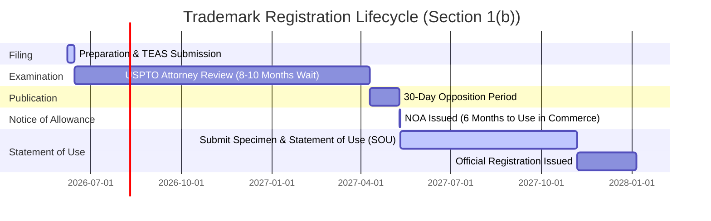

# 🐳 OrcasAgent Trademark Filing Roadmap & Strategy

Welcome to the **OrcasAgent Trademark Preparation Package**. This repository contains professional-grade draft application details, strategic guidance, and technical specifications designed to secure Federal Trademark protection for **OrcasAgent** (the brand name) and its visual brand identifiers.

All application documents have been pre-configured for **Individual Ownership** by **Karunanidhi Mishra**, with a focus on a **Section 1(b) (Intent-to-Use)** filing basis to reserve the marks prior to commercial launch.

---

## 🎯 Executive Summary & Strategy

To secure the most robust, legally defensive trademark portfolio for the minimum cost, we implement a **Dual-Track Trademark Registration** strategy:

### 1. Track 1: Standard Character Mark ("OrcasAgent")
*   **Target:** The brand name word mark: `OrcasAgent` (or `ORCASAGENT`).
*   **Protection Scope:** **Broadest possible.** This protects the text itself. No matter what font, color, layout, or stylized form you use in the future, others cannot use a confusingly similar name for software or agentic AI systems.
*   **Filing Class:** Filed under **Class 9** (Downloadable Software) and **Class 42** (SaaS/Cloud Services).

### 2. Track 2: Special Form / Design Marks (Grayscale Logos)
*   **Targets:** 
    *   The primary smiling mascot: [orcas-cute.svg](file:///C:/Users/rdpadmin/.gemini/antigravity/scratch/orcasagent-site/logo/orcas-cute.svg)
    *   The complete tech-grid lockup: [orcas-logo-full.svg](file:///C:/Users/rdpadmin/.gemini/antigravity/scratch/orcasagent-site/logo/orcas-logo-full.svg)
*   **Grayscale Strategy:** Both logos are filed in **grayscale (black & white)** with *no claim to color*. 
    *   > [!TIP]
        > Filing design marks in grayscale is a major strategic advantage. It protects your logo design **in any color combination**. If you rebranded later from cyan to purple, a color-claimed registration would lose protection, but a grayscale registration remains 100% valid.
*   **Filing Class:** Match the classes of the standard character mark (Class 9 and/or Class 42).

---

## 📋 Trademark Ownership & Filing Meta

All drafts in this package utilize the following official ownership details:

| Metadata Field | Value / Setup Details | Legal Significance |
| :--- | :--- | :--- |
| **Applicant Name** | **Karunanidhi Mishra** | Individual sole proprietor/owner of the trademark rights. |
| **Street Address** | **1713 Pelha Dr, Aubrey, TX 76227** | Official domicile address for public service of process. |
| **Filing Basis** | **Section 1(b) (Intent to Use)** | Used because OrcasAgent is in pre-launch. Reserves your rights as of the *filing date* before actual commerce begins. |
| **Legal Entity** | **Individual (United States Citizen)** | Filed as an individual. Can be transferred (assigned) to an LLC/Corporation later if incorporated. |

---

## 💰 Government Fees & Lifecycle Timeline

### Estimated Filing Costs (USPTO TEAS Standard)
*   **Standard Filing Fee:** **$350 per class per application** (as of mid-2026).
*   **Two Applications (Character + Mascot Logo) in Class 42:** $700.
*   **Two Applications in both Class 9 & Class 42:** $1,400.
*   **Intent-to-Use (Section 1(b)) Extension/Statement of Use Fees:** 
    *   **Statement of Use (SOU):** $150 per class (paid 6–18 months later when submitting specimens of actual use).

### Expected Timeline (USPTO)

---

## 🛠 Step-by-Step Filing Guide (USPTO TEAS)

When you are ready to file, follow these steps to use the pre-drafted data in this package:

### Step 1: Conduct a Preliminary Search
1. Visit the [USPTO Trademark Search Portal](https://tmsearch.uspto.gov/).
2. Perform a search for the text `"OrcasAgent"` to ensure no identical or confusingly similar phonetic marks exist in Class 9 or 42.
3. Search for design codes `03.19.21` (stylized whales/orcas) combined with software terms to ensure mascot uniqueness.

### Step 2: Access the TEAS System
1. Go to [USPTO Trademark Electronic Application System (TEAS)](https://www.uspto.gov/trademarks/apply/initial-application-forms).
2. Create or log into your USPTO.gov account (requires two-factor authentication).
3. Select **TEAS Standard Application**.

### Step 3: Enter Applicant Details
*   Select **Individual**.
*   Name: `Karunanidhi Mishra`
*   Address: `1713 Pelha Dr, Aubrey, TX 76227`
*   Citizenship: `United States` (or specify correct citizenship as applicable).

### Step 4: Enter Mark Information
*   **For the Character Application:** Select **Standard Characters** and type `OrcasAgent`.
*   **For the Logo Application:** Select **Special Form (Stylized and/or Design)**. Upload a high-resolution, black-and-white PNG/JPG of the logo. (See [draft_logo_application.md](file:///C:/Users/rdpadmin/.gemini/antigravity/scratch/orcasagent-site/trademark/draft_logo_application.md) for the exact design description to copy-paste).

### Step 5: Choose Class and Describe Goods/Services
*   Select **Class 9** (Downloadable Software) and/or **Class 42** (SaaS).
*   Copy and paste the custom-crafted, USPTO-compliant descriptions from our [draft_character_application.md](file:///C:/Users/rdpadmin/.gemini/antigravity/scratch/orcasagent-site/trademark/draft_character_application.md).

### Step 6: Select Section 1(b) (Intent to Use)
*   When prompted for the filing basis, select **Section 1(b)**. This means you do *not* have to upload a specimen (screenshot/proof) right now. You will submit the specimen later once the application is approved and the product is live.

### Step 7: Sign and Pay
*   E-sign the application as the applicant.
*   Pay the fee ($350 per class per application) via credit card or EFT.

---

## 📂 Trademark Documents Directory Map

Explore the following pre-compiled drafts to prepare your application forms:

*   📄 **[draft_character_application.md](file:///C:/Users/rdpadmin/.gemini/antigravity/scratch/orcasagent-site/trademark/draft_character_application.md)** - Complete standard character details, descriptions, and legal wording.
*   🎨 **[draft_logo_application.md](file:///C:/Users/rdpadmin/.gemini/antigravity/scratch/orcasagent-site/trademark/draft_logo_application.md)** - Logo-specific descriptions, design search codes, and grayscale declaration.
*   📸 **[specimens_guide.md](file:///C:/Users/rdpadmin/.gemini/antigravity/scratch/orcasagent-site/trademark/specimens_guide.md)** - Blueprint for future screenshots and proof of commercial use.

---

*Disclaimer: This documentation is for informational and drafting purposes only. I am an AI coding assistant, not a trademark attorney. Trademark law varies by jurisdiction, and seeking advice from a licensed trademark attorney is highly recommended before final submission.*
